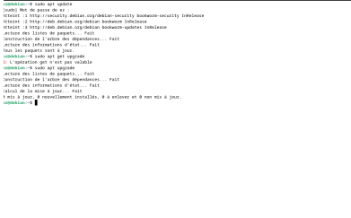
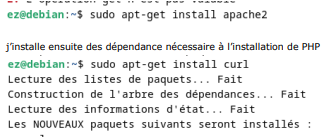
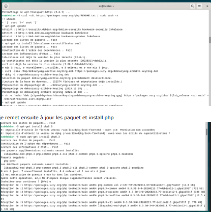
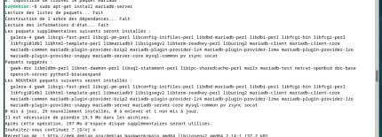
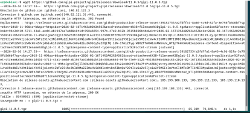
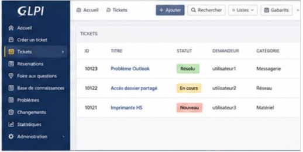

# GLPI Deployment on Debian 12

## Overview

This project demonstrates the installation and configuration of GLPI on Debian 12 to provide IT asset management and helpdesk ticketing services.

The objective was to centralize incident management and integrate user authentication through Active Directory.

## Technologies Used

- Debian 12
- Apache2
- PHP 8.3
- MariaDB
- GLPI 10
- LDAP
- Active Directory

## Features

- Debian 12 deployment
- Apache Web Server installation
- PHP configuration
- MariaDB database configuration
- GLPI installation
- Active Directory integration
- Ticket management platform deployment

## Skills Demonstrated

- Linux Administration
- Web Server Administration
- Database Management
- LDAP Authentication
- IT Service Management

## Project Architecture

```text
Debian 12
├── Apache2
├── PHP 8.3
├── MariaDB
└── GLPI
```

## Installation Process

1. Update system packages
2. Install Apache2
3. Install PHP 8.3 and required modules
4. Install and secure MariaDB
5. Create GLPI database
6. Download and deploy GLPI
7. Configure permissions

## Screenshots

### System Update



### Apache Installation



### PHP Installation



### MariaDB Configuration



### GLPI Installation



### GLPI Dashboard




## Project Outcome

Successfully deployed a functional GLPI platform on Debian 12 with centralized authentication through Active Directory and a complete ticket management system.
